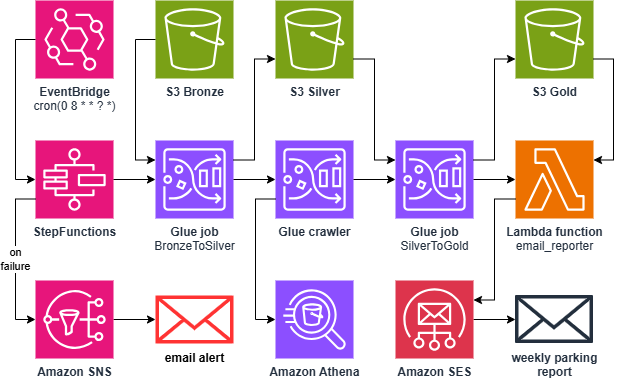
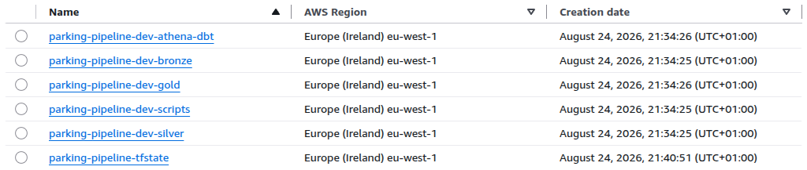
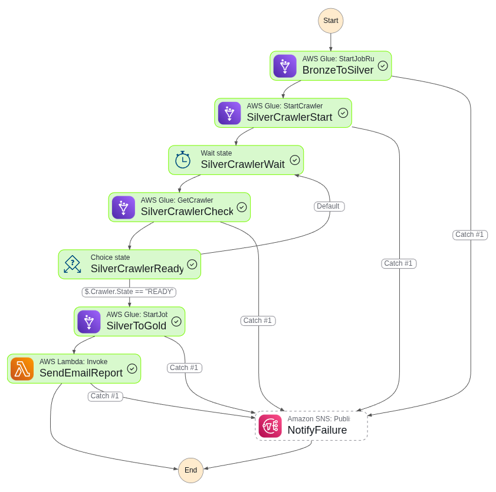
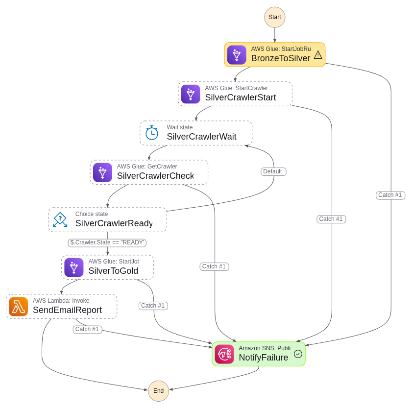
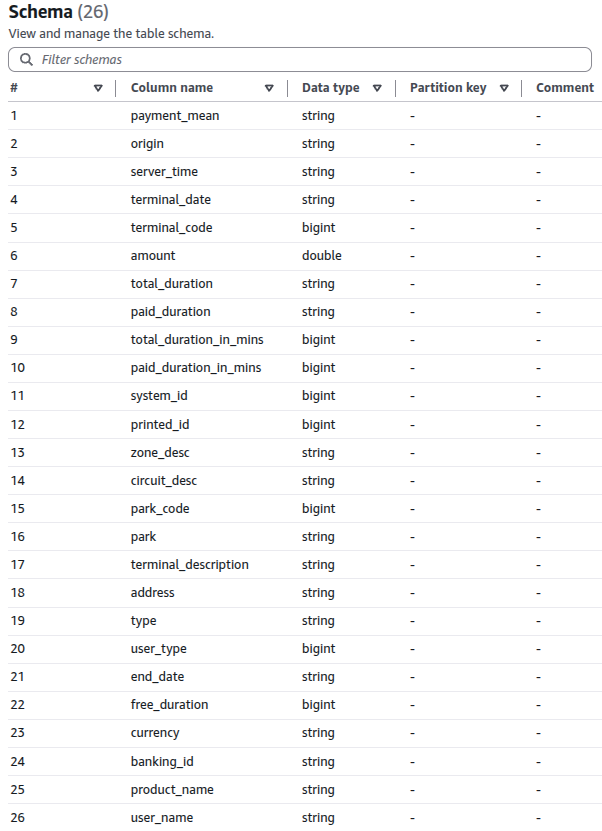
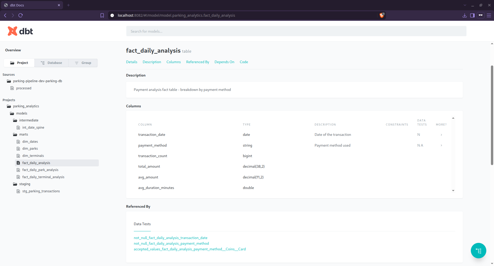
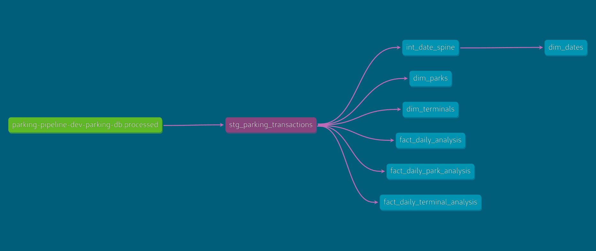
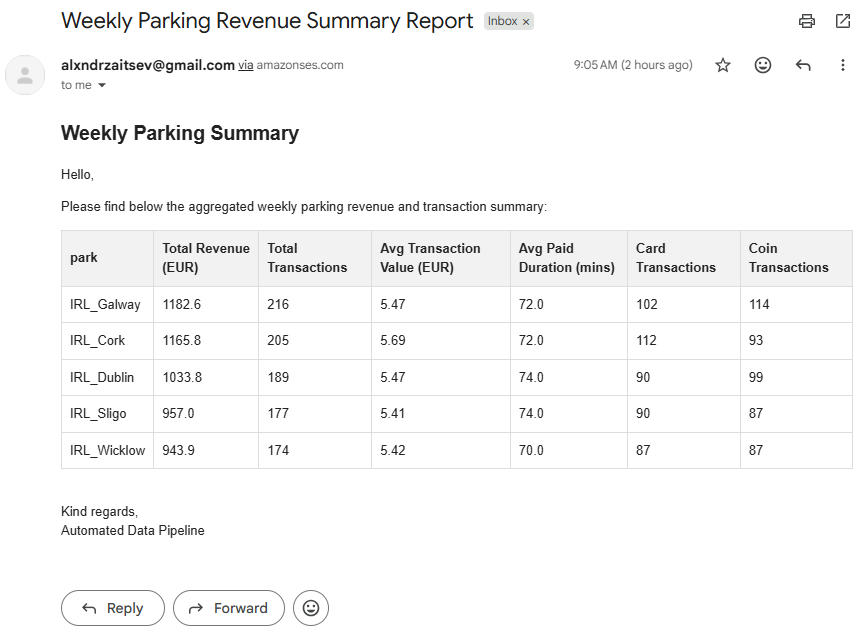
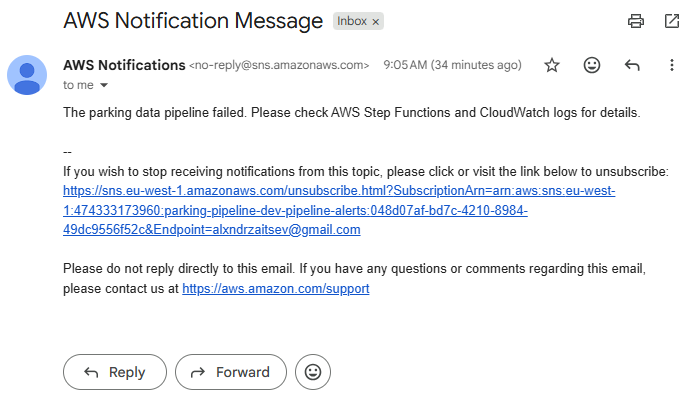

[](https://github.com/alxndrztsv/aws-parking-data-pipeline-synthetic/actions/workflows/ci.yml) [](https://github.com/alxndrztsv/aws-parking-data-pipeline-synthetic/actions/workflows/cd.yml)

# AWS Parking Data Pipeline

An end-to-end data pipeline for parking meter transactions in Ireland (Dublin, Cork, Galway), built on a medallion architecture (Bronze → Silver → Gold) with fully automated AWS infrastructure.

The data is **synthetic** — generated locally to mimic real pay-and-display parking exports — so the project can be run end-to-end on any AWS account without external data sources.

## Architecture

<p align="center">
  <a href="docs/architecture.png" target="_blank">
    
  </a>
  <br>
  <em>Figure 1: End-to-end data pipeline architecture.</em>
</p>

Pipeline stages:

1. **Ingest** — synthetic CSV files are uploaded to the Bronze S3 bucket by Terraform.
2. **Bronze → Silver** — an AWS Glue (PySpark) job validates and standardizes the raw data.
3. **Crawl** — a Glue crawler registers the Silver data in the Glue Data Catalog.
4. **Silver → Gold** — a second Glue job aggregates the data into a weekly summary and writes a `latest_report.json` pointer.
5. **Report** — a Lambda function reads the weekly summary and emails an HTML report via SES.
6. **Alerting** — any stage failure is published to an SNS topic and delivered by email.

An alternative orchestration path runs the same flow (plus a dbt analytics layer) from **Apache Airflow** — see [Airflow orchestration](#airflow-orchestration).

## Storage (S3)

<details>
  <summary>📂 Click to view S3 bucket structure (Medallion Architecture)</summary>
  <br>
  <p align="center">
    
    <br>
    <em>Raw CSVs in Bronze, processed CSVs in Silver, and aggregated report-ready CSV in Gold.</em>
  </p>
</details>

## Pipeline execution

<table>
  <tr>
    <th width="50%">✅ Successful step functions execution.</th>
    <th width="50%">🚨 Failed step functions execution.</th>
  </tr>
  <tr>
    <td></td>
    <td></td>
  </tr>
  <tr>
    <td><em>Successful Step Functions execution resulting in a report email.</em></td>
    <td><em>Failed Step Functions execution triggering an email alert.</em></td>
  </tr>
</table>

## Processed table schema

<details>
  <summary>📂 Click to view Glue Silver table schema</summary>
  <br>
  <p align="center">
    
    <br>
    <em>Glue Silver table contains 26 processed columns.</em>
  </p>
</details>

## Tech stack

| Area | Technology |
| --- | --- |
| Infrastructure as Code | Terraform (S3 backend with state locking) |
| Storage | S3 (Bronze / Silver / Gold / scripts / dbt buckets) |
| ETL | AWS Glue 4.0 (PySpark) |
| Catalog | Glue Data Catalog + Crawler |
| Orchestration | Step Functions (+ EventBridge schedule), Airflow 3 (local, optional) |
| Analytics | dbt Core with `dbt-athena` adapter |
| Reporting | Lambda + SES |
| Alerting | SNS + EventBridge failure rules |
| CI/CD | GitHub Actions, OIDC (no static AWS keys) |
| Tooling | Python 3.13, Docker, Make, Ruff |

## Repository structure

```
.
├── scripts/                  # Synthetic data generator
├── data/                     # Generated CSVs (gitignored)
├── glue_scripts/             # PySpark ETL jobs (uploaded to S3 by Terraform)
├── lambda_functions/         # SES email reporter source
├── terraform-bootstrap/      # One-time setup: tfstate bucket + GitHub OIDC role
├── terraform/                # Main infrastructure
├── airflow/                  # Local Airflow (docker-compose) + DAG
├── parking_analytics/        # dbt project (Athena)
└── .github/workflows/        # CI (lint + validate) and CD (plan/apply)
```

## Prerequisites

- AWS account with permissions to create IAM roles, S3, Glue, Lambda, SES, SNS, Step Functions
- [Terraform](https://www.terraform.io/) >= 1.6
- [Docker](https://docs.docker.com/get-docker/) (data generation + Airflow)
- Python 3.13 (local development)
- A **verified identity in SES** (sender address); in the SES sandbox both sender and recipient must be verified
- A GitHub repository (for OIDC-based deployment)

## Getting started

### 1. Bootstrap Terraform backend and OIDC

`terraform-bootstrap/` creates the S3 bucket that stores Terraform state and the IAM role that GitHub Actions assumes via OIDC. It runs with **local** state and is applied once, manually:

```bash
cd terraform-bootstrap
terraform init
terraform apply \
  -var="github_repo=<YOUR_GITHUB_USER>/<YOUR_REPO>" \
  -var="github_owner_id=<OWNER_ID>" \
  -var="github_repo_id=<REPO_ID>"
```

`OWNER_ID` and `REPO_ID` are the immutable numeric IDs GitHub now embeds in the OIDC `sub` claim (`repo:OWNER@<OWNER_ID>/REPO@<REPO_ID>:...`). Look them up via the GitHub API: `https://api.github.com/users/<YOUR_GITHUB_USER>` (field `id`) and `https://api.github.com/repos/<YOUR_GITHUB_USER>/<YOUR_REPO>` (field `id`).

Note the `github_actions_role_arn` output.

### 2. Configure GitHub

- Repository **Variables** (Settings → Variables, or inside the `dev` environment): `AWS_ROLE_ARN` (from the bootstrap output), `AWS_REGION` (e.g. `eu-west-1`), `ENVIRONMENT` (e.g. `dev`), `PROJECT_NAME` (e.g. `parking-pipeline`), `SENDER_EMAIL`, `RECIPIENT_EMAIL`, `FAILURE_NOTIFICATION_EMAIL` (SES-verified addresses; put these in **Secrets** instead if you don't want the addresses visible in workflow logs, and switch `vars.` to `secrets.` in `cd.yml`).
- Create a **`dev` environment** (Settings → Environments) and, optionally, add required reviewers — the CD `apply` job is gated on it.

### 3. Generate synthetic data

```bash
make generate-data          # local Python
# or with Docker:
make generate-data-docker   # builds the image and runs it
```

This writes `data/bronze/*_raw.csv` (raw exports) and `data/silver/*_processed.csv`.

### 4. Configure Terraform variables

Create `terraform/terraform.tfvars` (gitignored):

```hcl
aws_region                 = "eu-west-1"
environment                = "dev"
project_name               = "parking-pipeline"
sender_email               = "you@example.com"      # verified in SES
recipient_email            = "you@example.com"      # receives the weekly report
failure_notification_email = "you@example.com"      # receives pipeline alerts
```

### 5. Deploy

```bash
make tf-init    # terraform init -backend-config=backend.hcl
make tf-plan
make tf-apply
```

The apply also uploads the Glue scripts to the `scripts` bucket and the Bronze CSVs to `bronze/raw/`. Alternatively, push to the default branch and approve the CD `apply` job (see [CI/CD](#cicd)).

### 6. Verify

- Confirm the **SNS subscription** email (failure alerts).
- Trigger the pipeline: start a Step Functions execution manually, or wait for the daily 08:00 UTC EventBridge schedule. Check the SES report email afterwards.
- In the SES sandbox, the recipient must confirm the subscription and be verified, otherwise delivery silently fails.

## Airflow orchestration

The `airflow/` directory contains a local Airflow 3 stack (docker-compose, CeleryExecutor) with a DAG that orchestrates the same Glue/crawler/Lambda flow and additionally builds the **dbt models** via [Astronomer Cosmos](https://github.com/astronomer/astronomer-cosmos):

```
bronze_to_silver → silver_crawler → silver_to_gold → dbt_models → send_email_report → verify_email
```

The DAG runs weekly (Mondays 06:00 UTC) and publishes task failures to the same SNS topic.

```bash
make airflow-env    # creates airflow/.env from airflow/.env.example — fill in real values
make airflow-up     # builds the custom image and starts the stack
make airflow-logs   # follow logs
make airflow-down
```

The dbt project is mounted into the containers at `/opt/airflow/parking_analytics`. The image extends `apache/airflow` with `apache-airflow-providers-amazon`, `astronomer-cosmos` and `dbt-athena-community`.

## dbt analytics

`parking_analytics/` is a dbt project targeting **Athena** (via the Glue catalog):

- `staging/` — cleaned transactions
- `intermediate/` — date spine
- `marts/` — `dim_dates`, `dim_parks`, `dim_terminals`, `fact_daily_analysis`, `fact_daily_park_analysis`, `fact_daily_terminal_analysis`

<details>
  <summary>📂 Click to view payment analysis fact table</summary>
  <br>
  <p align="center">
    
    <br>
    <em>Payment analysis fact table.</em>
  </p>
</details>

<details>
  <summary>📂 Click to view dbt Lineage graph</summary>
  <br>
  <p align="center">
    
    <br>
    <em>dbt Lineage graph generated by dbt docs.</em>
  </p>
</details>

The profile lives inside the project (`parking_analytics/profiles.yml`) and points at the `athena-dbt` bucket for query results. Run models from the project directory:

```bash
cd parking_analytics
dbt deps && dbt build
```

Inside Airflow the same project is executed per-model as task groups by Cosmos.

## Alerts and reporting output

<table>
  <tr>
    <th width="50%">✅ Weekly email report (SES).</th>
    <th width="50%">🚨 Failure alert (SNS).</th>
  </tr>
  <tr>
    <td></td>
    <td></td>
  </tr>
  <tr>
    <td><em>HTML report generated by the Lambda function.</em></td>
    <td><em>Alert triggered by the EventBridge failure rule.</em></td>
  </tr>
</table>

## CI/CD

- **CI** (`.github/workflows/ci.yml`) — on PR and push: Ruff lint, `terraform fmt -check`, `init -backend=false` and `validate` for both `terraform/` and `terraform-bootstrap/`.
- **CD** (`.github/workflows/cd.yml`) — on push: `terraform plan` (artifact upload), then a manual-approval `apply` in the `dev` environment using the saved plan. AWS credentials come from the OIDC role — no long-lived keys.

## Make targets

| Target | Description |
| --- | --- |
| `setup` | Create `.venv` and install generator dependencies |
| `generate-data` | Generate synthetic data locally |
| `build-synthetic` / `generate-data-docker` | Build the generator image / run it |
| `airflow-env` / `airflow-up` / `airflow-down` / `airflow-logs` | Manage local Airflow |
| `tf-init` / `tf-plan` / `tf-apply` | Terraform workflow |
| `lint` | Ruff over the repository |

## Development notes

- All S3 buckets use `force_destroy = true`, versioning, AES-256 encryption and public-access blocks — suitable for a dev/demo environment only.
- Glue job bookmarks are disabled because the dataset is static and regenerated in place.
- The email Lambda runs on `python3.11` (Glue 4.0 jobs and the generator use newer runtimes).
- `data/`, Terraform state, `.env` files and `*.tfvars` are gitignored; `.env.example` documents the required Airflow variables.

## Cleanup

```bash
cd terraform && terraform destroy          # main stack
cd ../terraform-bootstrap && terraform destroy   # state bucket + OIDC role (local state)
```
